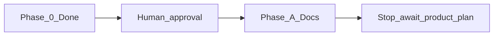

# Superdeterminism / Determinism Advisor — Master Execution Plan

> Nawab master plan. **Do not implement until this document is approved.**
> **Mode:** feature (research-docs completion). Product simulator is a later project plan.

---

## §0 Plan metadata

| Field | Value |
|-------|-------|
| **Mode** | feature |
| **Stack** | Docs-only today (Markdown). Future product: Python 3.10+, LangGraph/LangChain 1.x, OTLP ingest. No package exists yet. |
| **Base branch** | `main` |
| **Feature branch** | `cursor/determinism-advisor-docs-329f` |
| **Authority docs** | [AGENTS.md](AGENTS.md), [README.md](README.md), [docs/README.md](docs/README.md), this file |
| **Estimated commits** | 7–8 remaining for Phase A (docs). Product v0 is out of this plan. |
| **Lead agent** | Orchestrate, commit, integrate, PR. No product code in this plan. |

**Already on this branch (do not redo):**

| Commit | What |
|--------|------|
| `0898037` | README, Apache-2.0 LICENSE, CONTRIBUTING, docs index |
| `4d41000` | Vendored [cursor-config-coding](https://github.com/Vinayak-RZ/cursor-config-coding)@437a548 — rules, skills, MCP, `AGENTS.md`, `.cursor/environment.json` |

---

## §1 North star & scope boundary

### Objective

Ship a research-backed documentation contract so any later agent can implement Determinism Advisor without inventing whitespace claims, ingest mappings, or a simulation methodology.

### Deliverables (this plan)

- Research docs listed in §9 (overview through ADRs)
- [PROGRESS.md](PROGRESS.md) updated as phases complete
- This plan kept current

### Non-goals

- Simulator, CLI, Python package, or LangGraph adapter code
- Auto-refactor engine or in-place `graph.py` edits
- Renaming the GitHub repo (`superdeterminisiom`)
- Wrapping CAR / Tracefork / counterfact as dependencies (later ADR)
- Triggering a Cloud Agent environment build (docs-only; `environment.json` is a presence check)
- Re-vendoring cursor-config-coding unless upstream moved

### Priority

| Priority | Items |
|----------|-------|
| **P0** | Remaining research docs + ADRs + references; claim hygiene; methodology limitations first |
| **P1** | Product v0 implementation (separate project-mode nawab plan after docs exist) |

---

## §2 Prerequisites & blockers

| Item | Status | Blocks | Resolution |
|------|--------|--------|------------|
| cursor-config-coding vendored | done | agent workflow | `.cursor/` + `AGENTS.md` on this branch |
| User approval of this plan | **pending** | Phase A writes | Wait. Do not write remaining docs until approved. |
| Agent Patterns Catalog MCP | unavailable in this Cloud Agent | citations only | Cite catalog conceptually; do not invent pattern ids |
| OTel GenAI spec stability | Development, no tags | ingest doc pinning | Pin commit in `docs/ingestion.md`, not a semconv version |
| Product stack choice | deferred | product plan | Decide in a later project-mode plan |

**Hard rule:** Phase A does not start while “User approval of this plan” is pending.

---

## §3 Authority & artifact map

| Document | Path | Role |
|----------|------|------|
| Agent instructions | `AGENTS.md` | Read-only workflow + claim hygiene |
| This plan | `IMPLEMENTATION_PLAN.md` | Writable execution contract |
| Progress | `PROGRESS.md` | Writable live status |
| ADRs | `docs/decisions/` | Writable; created in Phase A |
| Doc index | `docs/README.md` | Writable when new docs land |
| Spec Kit | `.specify/` | N/A — not installed; docs are not a Spec Kit feature |
| Vendored config | `.cursor/VENDOR.md` | Read-only pin |

Subagents: research notes are **read-only authority**. Only the lead writes `docs/*.md`.

---

## §4 Architecture & system map

Target product (documented now, not built in this plan):

```mermaid
flowchart LR
  traces[OTLP_traces] --> ingest[Normalize_spans]
  ingest --> graph[Architecture_graph]
  graph --> sim[Offline_counterfactuals]
  sim --> recs[Ranked_recommendations]
  recs --> report[Report_plus_optional_scaffold]
```

Differentiation:

> Counterfactual *re-typing* of nodes between deterministic tools and stochastic LLM/subagents, on ingested production graphs.

### Target layout after Phase A

```text
repo/
├── AGENTS.md
├── IMPLEMENTATION_PLAN.md
├── PROGRESS.md
├── README.md
├── LICENSE
├── CONTRIBUTING.md
├── .cursor/                    # vendored coding config
├── docs/
│   ├── README.md
│   ├── overview.md
│   ├── landscape.md
│   ├── ingestion.md
│   ├── architecture.md
│   ├── methodology.md
│   ├── adapters.md
│   ├── refactor.md
│   ├── roadmap.md
│   ├── references.md
│   ├── decisions/0001-otel-ingest.md
│   ├── decisions/0002-v0-offline-first.md
│   ├── decisions/0003-no-auto-apply.md
│   └── (vendored cursor-config guides)
└── scripts/                    # vendor PowerShell helpers
```

### Trust boundaries

- No secrets in docs or `.cursor/mcp.json` (public Agent Patterns URL only)
- Do not invent `gen_ai.*` keys; Advisor fields are `advisor.*` / `det.*`
- Simulation claims must say **simulation ≠ production**

---

## §5 Workstreams

| ID | Name | Owns paths | Depends on | Lead / subagent |
|----|------|------------|------------|-----------------|
| WS-A | Research docs | `docs/overview.md` … `docs/decisions/*`, `docs/references.md` | plan approved | lead |
| WS-B | Product v0 | future `src/` | Phase A + new project plan | N/A this plan |

### WS-A — Research docs

- **Objective:** Write the missing research contract.
- **Phases:** A only.
- **Integration:** Docs are the product of this plan.

### WS-B — Product v0

- **Objective:** N/A — [deferred to a later project-mode plan]
- **Integration:** N/A

---

## §6 Agent orchestration & subagent spawn map

| ID | Trigger | Type | readonly | Task | Sync point | Gate |
|----|---------|------|----------|------|------------|------|
| S1 | After approval, before commit 3 | explore | true | Recheck CAR / Tracefork / OTel URLs still resolve | Before `docs/landscape.md` + `docs/ingestion.md` | lead integrates citations |
| S2 | After Phase A docs exist | generalPurpose | true | Cross-link + claim-hygiene review | Before last docs commit | no new whitespace claims |

**Parallel limit:** 2  
**File ownership:** lead writes all `docs/*.md`. Subagents return notes only.

### Spawn S1

```text
Full Repository Path: /workspace
Workstream: WS-A
Task: Verify citation URLs in the planned landscape/ingestion set still resolve.
Authority: IMPLEMENTATION_PLAN.md §11
Return: table of URL → HTTP status / title drift
Do NOT: edit files, expand into product code
```

---

## §7 Phase map & dependencies



| Phase | Objective | Workstreams | Commits | Depends on | Exit gate |
|-------|-----------|-------------|---------|------------|-----------|
| 0 | Config + plan | — | already done + this file | — | This plan pushed; user can review |
| A | Write research docs | WS-A | 7 rows in §9 | user approval | Every planned path exists; links resolve; no false whitespace |
| Product | Simulator | WS-B | N/A | new approved project plan | N/A this plan |
| N | Validation | WS-A | last §9 row | A writes | markdown link check + claim grep |
| Cutover | N/A — [docs feature; no consumer switch] | — | — | — | — |

---

## §8 Todo registry

```yaml
todos:
  - id: approve-plan
    content: "Human approves IMPLEMENTATION_PLAN.md"
    status: pending
  - id: phase-a-overview-landscape
    content: "Write docs/overview.md and docs/landscape.md"
    status: pending
  - id: phase-a-ingestion-architecture
    content: "Write docs/ingestion.md and docs/architecture.md"
    status: pending
  - id: phase-a-methodology
    content: "Write docs/methodology.md"
    status: pending
  - id: phase-a-adapters-refactor
    content: "Write docs/adapters.md and docs/refactor.md"
    status: pending
  - id: phase-a-roadmap-refs-adrs
    content: "Write roadmap, references, and three ADRs"
    status: pending
  - id: phase-a-validate
    content: "Link check, claim hygiene, PROGRESS.md"
    status: pending
  - id: product-v0-plan
    content: "Separate project-mode nawab plan for the simulator (after docs)"
    status: pending
```

---

## §9 Commit matrix

Work class: **medium product feature (docs)** → **7–8** commits remaining. Do not pad.

### Phase A — Research docs (WS-A)

| # | WS | Commit | Contents | Tests (same commit) | Gate | Agent |
|---|-----|--------|----------|---------------------|------|-------|
| 1 | A | `docs: add overview and landscape` | `docs/overview.md`, `docs/landscape.md` | claim-hygiene read | files exist; no “nobody does counterfactual simulation” | lead |
| 2 | A | `docs: add OTel ingest and domain architecture` | `docs/ingestion.md`, `docs/architecture.md` | citation URLs | pin GenAI commit; `advisor.*` namespace stated | lead |
| 3 | A | `docs: add determinism-flip methodology` | `docs/methodology.md` | limitations section present | L0/L1/L2 named; FlipToDet/Nondet/SDB/ABSTAIN; simulation ≠ production | lead |
| 4 | A | `docs: add LangGraph adapters and refactor assist` | `docs/adapters.md`, `docs/refactor.md` | — | `create_agent` not `create_react_agent`; no auto-apply | lead |
| 5 | A | `docs: add roadmap, references, and ADRs` | `docs/roadmap.md`, `docs/references.md`, `docs/decisions/0001-*.md`, `0002-*.md`, `0003-*.md` | — | three ADRs match §11 | lead |
| 6 | A | `docs: sync index and progress` | `docs/README.md`, `PROGRESS.md` | — | index lists every new file | lead |
| 7 | A | `docs: validate research contract` | link/claim fixes only | `rg` for forbidden phrases | no forbidden claims; relative links resolve | lead |

**Phase A gate:** all P0 paths exist; `docs/README.md` is complete; this plan’s §16 P0 boxes can be checked.

Each research doc stays **under ~400 lines**. Citations go in `docs/references.md`.

---

## §10 Test & CI strategy

No application test runner exists. Gates are documentary.

| Tier | Purpose | Trigger | Command |
|------|---------|---------|---------|
| Fast | files exist + forbidden-claim grep | every docs commit | `test -f docs/<name>.md`; `rg -n "nobody does counterfactual" docs/` must be empty (except landscape “do not claim” section) |
| Medium | relative link sanity | Phase A end | lead checks `docs/README.md` links |
| Slow | N/A — [no product] | — | — |

### CI workflow map

| Job | Trigger | Command |
|-----|---------|---------|
| N/A | — | No CI until a later product plan adds it |

**Test locations:** N/A — [docs feature]  
**Contract-first:** the docs *are* the contract for a future product plan.

---

## §11 Research log & decisions

| Topic | Options | Choice | Source / skill | Record in |
|-------|---------|--------|----------------|-----------|
| Product whitespace | “Nobody simulates agents” vs “nobody flips determinism class on ingested graphs” | Tight second claim | CAR arXiv:2606.08275; CausalFlow arXiv:2605.25338; Tracefork; counterfact; MaAS; DeepEval Tool Correctness | `docs/landscape.md` |
| Ingest substrate | New SDK vs OTLP + private namespace | OTLP ingest; `advisor.*` / `det.*` | OTel `semantic-conventions-genai` (Development; core v1.42 moved GenAI out); LangSmith OTLP quirks | ADR 0001 |
| Simulation fidelity | Live L2 `do_policy` vs offline L0 | v0 offline-first; no production-LLM re-runs | CAR `do_policy`; AgentReplay/Tracefork tapes; WHEN2TOOL arXiv:2605.09252 | ADR 0002 |
| Refactor assist | Auto-PR vs report + scaffold | Report + optional scaffold; keep node name | LangGraph `create_agent`; CAR/Tracefork/counterfact hook points | ADR 0003 |
| Naming | Repo typo vs new GitHub name | Project **Superdeterminism**; repo URL unchanged | User default in prior plan | README |
| License | MIT vs Apache-2.0 | Apache-2.0 | Matches MLflow/DeepEval; patent grant | LICENSE |
| Cursor config | Symlink vs vendor copy | Vendor `.cursor/` into this repo | cursor-config-coding README “Cloud agents” | `.cursor/VENDOR.md` |
| Agent Patterns MCP | Live query vs skip | Skip this session — server not connected | `mcp-architecture.mdc` | note only |
| Skills used to author this plan | — | nawab-plans, planning.mdc, agentic-system-design, trade-offs | `.cursor/skills/*` | this table |

---

## §12 Documentation & artifact sync

| Event | Update |
|-------|--------|
| Plan approved | `IMPLEMENTATION_PLAN.md` status line; start Phase A |
| Each §9 commit | touched docs only |
| Phase A complete | `PROGRESS.md` |
| Arch decision | `docs/decisions/` (created in commit 5) |
| Cutover | N/A |

---

## §13 Quality gates & checkpoints

| Gate | When | Command / checklist | Blocks |
|------|------|---------------------|--------|
| Plan approved | now | user says approve / implement | Phase A |
| Doc length | each write | ≤ ~400 lines | split or move cites |
| Claim hygiene | each write | no false whitespace | merge |
| Phase A done | end A | all §9 paths exist | product plan |
| PR merge | review | fast tier | main |

### Human checkpoints

- [ ] User approves this plan before any remaining research docs are written
- [ ] User approves a **separate** project-mode plan before simulator code

---

## §14 Validation & hardening

### Repo walkthrough

1. Static: no secrets; no invented `gen_ai.*`
2. Forbidden-claim grep
3. Cross-links from `docs/README.md`
4. ponytail-review is N/A for prose-only unless a later product diff exists
5. speckit-converge N/A — [no `.specify/`]
6. Fix gaps in commit 7 only
7. Manual: README still states docs-only status

### Orchestrator

N/A — [no `scripts/validate.sh` until product plan]. Lead runs the fast-tier checks in §10.

---

## §15 Rollout & cutover

N/A — [documentation feature; no production consumer]

---

## §16 Exit criteria

### P0 (must pass)

- [ ] User approved this plan before Phase A writes
- [ ] All Phase A paths in §4 exist
- [ ] Landscape states safe vs unsafe claims
- [ ] Methodology names L0/L1/L2 and ABSTAIN
- [ ] ADRs 0001–0003 exist
- [ ] `PROGRESS.md` marks Phase A complete
- [ ] Draft PR updated with the docs (after approval)

### P1 (defer ok)

- [ ] Product v0 project-mode nawab plan
- [ ] Spec Kit `.specify/` for the simulator
- [ ] CI workflow
- [ ] Environment build / snapshot

---

## §17 Risks & contingencies

| Risk | Likelihood | Impact | Mitigation | Contingency |
|------|------------|--------|------------|-------------|
| Adjacent tools ship a determinism-class advisor | med | high | date landscape 2026-08-15; re-search at Phase A start (S1) | tighten claim, do not delete the product |
| OTel GenAI names move | high | med | pin commit; coalesce dual keys | remap in ingest doc |
| Offline L0 looks more confident than it is | high | high | limitations lead methodology | ABSTAIN as first-class |
| Docs exceed 400 lines | med | low | cites in references.md | split only if a section is a second topic |
| Implementing product before docs | med | high | approval gate §13 | refuse code until product plan exists |
| Vendored config drifts from upstream | med | low | VENDOR.md pin | re-vendor in a chore commit |

---

## §18 Execution protocol

```text
1. Load this plan + nawab-plans; ponytail only if a later plan adds code
2. Do not write Phase A docs until §2 "User approval" is done
3. After approval:
   a. Sync §8 todos
   b. Spawn S1 (URL check) before landscape/ingestion commits
   c. For each §9 row: write → gate → commit → push (one row per commit)
   d. Integrate S2 notes before commit 7
   e. Update PROGRESS.md
4. Stop. Do not start product code. Offer a project-mode plan if asked.
```

---

## What changed vs the previous docs plan

1. **Cursor config is a prerequisite, not a side note** — already vendored and pushed.
2. **Nawab contract** — 18 sections, commit matrix, spawn map, approval gate.
3. **Implementation is split** — this plan is docs only; simulator needs a second plan.
4. **False-whitespace language is a gate**, not a footnote.
5. **MCP is recorded as unavailable** here; do not fake pattern ids.
6. **Stop after Phase A** — matches “improve the plan, then we implement.”

---

## Open questions

- Confirm Apache-2.0 and the Superdeterminism / Determinism Advisor names still stand (defaults from the prior plan).
- After Phase A, should the product plan be Python-first (LangGraph adapter) or stay docs + fixtures only for another cycle?

---

## Approval

**Mode:** feature  
Plan ready for review. Approve to begin **Phase A** (research docs only).  
Lead agent follows **§18 Execution protocol**. Product code waits for a later project-mode plan.
