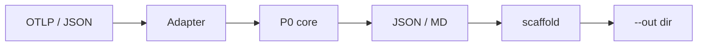
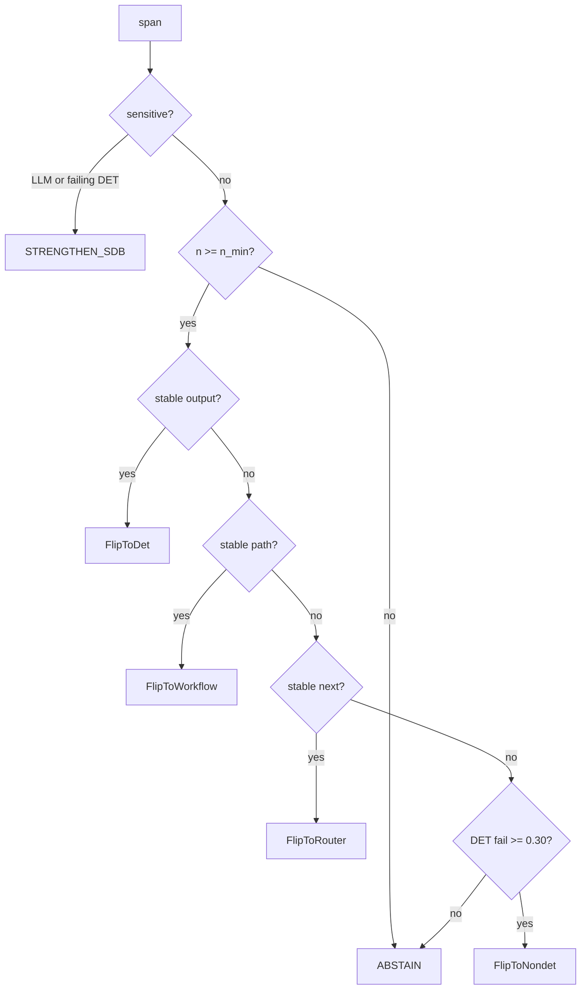

# Superdeterminism

**Architecture Advisor** — counterfactual re-typing of agent graph roles (workflow ↔ subagent ↔ tool ↔ router ↔ LLM, plus the orchestrator) from production traces.

[](https://github.com/Vinayak-RZ/superdeterminisiom/actions/workflows/ci.yml)
[](LICENSE)
[](pyproject.toml)
[](#2-architecture)

> **What it is:** An open-source design-time advisor that ingests production agent traces, reconstructs the architecture graph (including who owns control flow), and estimates which roles nodes — and the orchestrator — should have.  
> **What it is not:** A runtime eval platform, a workflow searcher, or a LangChain-only plugin.  
> **Primary interface:** CLI — `python -m superdeterminism recommend` (JSON in/out). Agents drive it; humans can too.

The GitHub repository is still named `superdeterminisiom`. The project name is **Superdeterminism**.

> [!IMPORTANT]
> Simulation ≠ production. Every number is an observational L0 estimate. A canary with the same outcome vector is the only confirmatory check. The tool never auto-applies a refactor.

---

**TL;DR**

- Teams guess workflow vs subagent vs tool vs router vs open LLM — and whether the orchestrator should exist at all. That guess is expensive in regulated and cost-sensitive systems.
- Eval tools score the path you already ran. Architecture-search papers invent new graphs offline. Neither re-types *roles* on an ingested production graph.
- Adjacent counterfactual simulators (CAR, CausalFlow, Tracefork, AgentReplay, counterfact) exist. The unclaimed layer is the **role flip + orchestrator recommendation**.
- P0 core is **stdlib-only**. No LangChain import. Adapters translate traces into the same recommender.
- Node actions: FlipToDet, FlipToWorkflow, FlipToSubagent, FlipToRouter, FlipToNondet, STRENGTHEN_SDB, or **ABSTAIN**. Hub actions: Bound / Strengthen / FlipToCode / Collapse orchestrator.
- Hard override: refund / commit / payment / auth / PII names stay deterministic gates.
- CLI is non-interactive. Exit `0` on a report (including all-ABSTAIN). Exit `2` on bad input.
- Scaffold writes under `--out` only. It never edits `graph.py`.
- Optional extras: `[langgraph]`, `[crewai]`. Langfuse / MAF / custom need no extra.
- Live L1 tail, L2 `do_policy`, hosted collector, and auto-apply are **not** implemented.

## Table of contents

1. [Vision](#1-vision)
2. [Architecture](#2-architecture)
3. [Quickstart](#3-quickstart)
4. [CLI](#4-cli)
5. [Configuration](#5-configuration)
6. [Decision rules](#6-decision-rules)
7. [Adapters](#7-adapters)
8. [Comparison](#8-comparison)
9. [Project structure](#9-project-structure)
10. [Testing](#10-testing)
11. [Documentation](#11-documentation)
12. [Roadmap and changelog](#12-roadmap-and-changelog)
13. [FAQ](#13-faq)
14. [Glossary](#14-glossary)
15. [Contributing](#15-contributing)
16. [License](#16-license)

Omitted until they exist: HTTP API, Docker, deployment, PyPI publish.

## 1. Vision

### 1.1 What it is

An advisor that takes production agent traces, reconstructs the architecture (including the control-flow owner), and estimates counterfactual **re-typing** of roles — workflow vs subagent vs tool vs router vs LLM, plus orchestrator bound/collapse/code-route — with evidence, not gut feel.

### 1.2 What it is not

- Not “score the path you already ran” (LangSmith, MLflow, DeepEval, Galileo, Langfuse).
- Not “search a new workflow from scratch” (MaAS, AFlow).
- Not a claim that nobody does counterfactual agent simulation. See [docs/landscape.md](docs/landscape.md).
- Not a production A/B platform. L0/L1 estimates are not live `do_policy`.

### 1.3 Who it is for

Developers past prototype — especially in regulated or cost-sensitive systems — and coding agents that can run a JSON CLI.

### 1.4 Success criteria

A third party can ingest traces, get a report that may **ABSTAIN**, copy a custom adapter from one file, and never see the tool rewrite their graph.

## 2. Architecture

P0 is the recommender. P1/P2 are adapters. One decision engine.



```text
OTLP or {traces:[{spans:[...]}]}
  → classify node_kind + det.class
  → L0 observational recommend (Wilson, n_min)
  → FlipToDet | FlipToNondet | STRENGTHEN_SDB | ABSTAIN
  → report + optional write-only scaffold
```

Advisor-owned fields live in `advisor.*` / `det.*`. Never invent `gen_ai.*` keys. Temperature 0 is not a seed.

### 2.1 Key modules

| Path | Job |
|---|---|
| [`src/superdeterminism/models.py`](src/superdeterminism/models.py) | `NodeKind`, `DetClass`, `Action`, `Span`, `Trace`, `Recommendation` |
| [`src/superdeterminism/pipeline.py`](src/superdeterminism/pipeline.py) | Ingest, classify, L0 recommend, report + canary |
| [`src/superdeterminism/cli.py`](src/superdeterminism/cli.py) | `recommend` and `scaffold` |
| [`src/superdeterminism/scaffold.py`](src/superdeterminism/scaffold.py) | Write-only `REPORT.md` / `WIRING.md` / `patches/*.diff` |
| [`src/superdeterminism/adapters/`](src/superdeterminism/adapters/) | Lazy registry + LangGraph / Langfuse / MAF / CrewAI |
| [`examples/custom_adapter.py`](examples/custom_adapter.py) | Copy-this-file adapter contract |

## 3. Quickstart

### 3.1 Prerequisites

Python 3.10+. No framework extra required for the core path.

### 3.2 Install

```bash
pip install -e ".[dev]"
```

### 3.3 Run

```bash
python -m superdeterminism recommend tests/fixtures/advisor_stable_llm.json --n-min 1 --stdout json
```

Agents: always `--stdout json`. Humans can add `--md report.md`.

A single-trace file at the default `--n-min 30` will **ABSTAIN**. That is correct.

### 3.4 Verify

```bash
python -m pytest -q
```

## 4. CLI

Two commands. No prompts. No auto-apply.

| Command | What it does |
|---|---|
| `recommend` | Ingest traces → L0 report on stdout |
| `scaffold` | Write illustrative files under `--out` only |

### 4.1 `recommend`

| Flag | Default | What it does |
|---|---|---|
| `traces` | — | One OTLP JSON or `{traces:[...]}` file |
| `--traces-dir DIR` | — | Every `*.json` in DIR → one report |
| `--adapter NAME` | omitted | Optional ingest mapper (see §7) |
| `--n-min N` | `30` | Minimum observations before a flip |
| `--stdout json\|md` | `json` | Print this format |
| `--json PATH` | — | Also write JSON |
| `--md PATH` | — | Also write Markdown |
| `--opt-in-l1` | off | Warns; does **not** call a model unless a live tail exists (not implemented) |

Exit `0` if a report was produced (including all-ABSTAIN). Exit `2` on bad input, unknown adapter, or missing extra.

### 4.2 `scaffold`

```bash
python -m superdeterminism scaffold report.json --out scaffold/RUN
```

Writes `REPORT.md`, `WIRING.md`, and `patches/*.diff` under `--out`. Never touches user `graph.py`. All-ABSTAIN reports get reasons only (no patches). Do not apply a patch unless a human asked.

### 4.3 Report shape

JSON includes `disclaimer`, `estimator`, `canary`, `orchestrator` (hub metrics + action), and `recommendations[]` (each row has `from_kind` / `to_kind`).

Node actions: `FlipToDet` | `FlipToWorkflow` | `FlipToSubagent` | `FlipToRouter` | `FlipToNondet` | `STRENGTHEN_SDB` | `ABSTAIN`

Hub actions: `BoundOrchestrator` | `StrengthenOrchestrator` | `FlipOrchestratorToCode` | `CollapseOrchestrator` | `ABSTAIN`

Full examples: [docs/usage.md](docs/usage.md).

## 5. Configuration

No required environment variables. Core has zero runtime config files.

| Variable | Required | Default | Description |
|----------|----------|---------|-------------|
| `SUPERDETERMINISM_L1_MODEL` | No | unset | Reserved. Live L1 tail is **not** implemented. Setting it does not open a network client. |

See [`.env.example`](.env.example). Do not commit a real `.env`.

Thresholds live in [`src/superdeterminism/pipeline.py`](src/superdeterminism/pipeline.py): `N_MIN_DEFAULT=30`, `SCHEMA_OK_MIN=0.80`, `P_MODE_MIN=0.70`.

## 6. Decision rules

Implemented in `_decide()` and `_decide_orchestrator()` — observational L0 proxy, not L2 `do_policy`. Prefer the lowest Anthropic rung the tape supports. Full table: [docs/type-lattice.md](docs/type-lattice.md), [docs/orchestrator.md](docs/orchestrator.md).

| Condition | Action |
|---|---|
| Node name matches refund/commit/payment/auth/PII/… and the node is LLM | `STRENGTHEN_SDB` |
| Sensitive DET node has failures | `STRENGTHEN_SDB` |
| `n < n_min` | `ABSTAIN` |
| LLM + `schema_ok ≥ 0.80` + `p_mode` and Wilson lower ≥ `0.70` | `FlipToDet` |
| Path length ≥ 3, `p_path` + Wilson ≥ `0.70`, output not mode-stable | `FlipToWorkflow` |
| Nested checkpoint ns, structured return, output not mode-stable | `FlipToSubagent` |
| Next-hop `p_next` + Wilson ≥ `0.70` | `FlipToRouter` |
| DET `failure_rate ≥ 0.30` and not sensitive | `FlipToNondet` |
| Hub reaches sensitive tool with no DET gate | `StrengthenOrchestrator` |
| Hub hops high or `revisit_rate ≥ 0.30` | `BoundOrchestrator` |
| LLM supervisor next-hop stable | `FlipOrchestratorToCode` |
| Supervisor + workers, path stable, no isolation win | `CollapseOrchestrator` |
| Point estimate meets threshold but Wilson lower does not | `ABSTAIN` |
| Nothing else fires | `ABSTAIN` |



Methodology and threats: [docs/methodology.md](docs/methodology.md).

## 7. Adapters

`--adapter` is optional. Omitted = P0 generic ingest. Registry is lazy: adapter modules are imported only on `resolve()`.

| Name | Extra | What it does |
|---|---|---|
| *(omitted)* | none | OTLP or `{traces:[...]}` |
| `langgraph` | `[langgraph]` | `create_agent` (`model`/`tools`) and custom `StateGraph`; drops `__start__`/`__end__`; LangSmith retriever→embeddings quirk |
| `custom` | none | [`examples/custom_adapter.py`](examples/custom_adapter.py) — copy this file |
| `langfuse` | none | Coalesce `langfuse.observation.type` onto existing `gen_ai.operation.name` |
| `maf` | none | Dedicated Microsoft Agent Framework mapper |
| `crewai` | `[crewai]` | Kickoff → `invoke_workflow` |

`--adapter langgraph` on a MAF-shaped file exits `2` with a reason. Do not silently remap.

MLflow is documented only. Omitted ops stay `UNKNOWN` and **ABSTAIN**. See [docs/ingestion.md](docs/ingestion.md).

Install extras:

```bash
pip install -e ".[dev,langgraph]"
pip install -e ".[dev,crewai]"
```

## 8. Comparison

| | Superdeterminism | LangSmith / Langfuse / MLflow | MaAS / AFlow | CAR / Tracefork / counterfact |
|---|---|---|---|---|
| Job | Re-type roles + orchestrator on an ingested graph | Score the path you already ran | Search a new workflow | Counterfactual replay of the **same** types |
| Input | Exported OTLP / advisor JSON | Live traces | Spec / search space | Recorded trajectory / tape |
| Output | Flip / strengthen / ABSTAIN + canary text | Scores, spans, evals | A new graph | What-if on the existing policy |
| Apply | Human copies scaffold | n/a | Search output | Replay / diagnose |

Differentiation must stay: counterfactual *re-typing*, not “score the path” and not “search from scratch.”

## 9. Project structure

```text
AGENTS.md                 Agent instructions + claim hygiene
PROJECT_OVERVIEW.md       Purpose, architecture, constraints
IMPLEMENTATION_PLAN.md    Nawab execution contract
PROGRESS.md               Live phase status
DECISIONS.md              Decision index
LEARNING.md               Phase learnings
CONTRIBUTING.md           How to change docs and code
LICENSE                   Apache-2.0
pyproject.toml            Package + extras
.env.example              Reserved L1 env (unused)
src/superdeterminism/     Agnostic core + adapters
examples/                 Copy-this-file custom adapter
tests/                    Fixtures + pytest
.github/workflows/ci.yml  Extras-free CI
.cursor/                  Vendored coding config
docs/                     Research contract + ADRs
docs/cursor-config/       Vendored cursor-config-coding guides
docs/decisions/           ADRs 0001–0004
```

## 10. Testing

```bash
pip install -e ".[dev]"
python -m pytest -q
```

Extras-free gate: core + adapter tests that do not need LangGraph or CrewAI. Tests that require a missing extra **skip**. Tests that assert “missing extra → exit 2” **skip** when that extra is installed.

CI ([`.github/workflows/ci.yml`](.github/workflows/ci.yml)) runs the extras-free install on Python 3.10 and 3.12, then pytest, then a `create_react_agent` token check.

Planted fixtures: [`tests/fixtures/planted_det.json`](tests/fixtures/planted_det.json) (FlipToDet at `n_min=30`) and [`tests/fixtures/planted_open_ended.json`](tests/fixtures/planted_open_ended.json) (ABSTAIN).

Import hygiene: no `langchain` / `langgraph` import outside `adapters/langgraph.py` (and that file is attribute-only). No `create_react_agent` in `src/`.

## 11. Documentation

| Doc | What it covers |
|---|---|
| [docs/README.md](docs/README.md) | Doc map |
| [docs/overview.md](docs/overview.md) | Problem, loop, audience |
| [docs/landscape.md](docs/landscape.md) | Adjacent tools; safe vs unsafe claims |
| [docs/ingestion.md](docs/ingestion.md) | OTel GenAI substrate + MLflow gaps |
| [docs/architecture.md](docs/architecture.md) | `node_kind`, `det.class` |
| [docs/methodology.md](docs/methodology.md) | How a flip is estimated |
| [docs/agent-architectures.md](docs/agent-architectures.md) | Workflow vs agent doctrine |
| [docs/type-lattice.md](docs/type-lattice.md) | Role actions |
| [docs/orchestrator.md](docs/orchestrator.md) | Control-flow owner |
| [docs/adapters.md](docs/adapters.md) | LangGraph + other stacks |
| [docs/refactor.md](docs/refactor.md) | Report + scaffold; no auto-apply |
| [docs/roadmap.md](docs/roadmap.md) | P0 / P1 / P2 index |
| [docs/p1-langgraph.md](docs/p1-langgraph.md) | P1 LangGraph adapter (implemented) |
| [docs/p2-ecosystem.md](docs/p2-ecosystem.md) | P2 ecosystem (implemented) |
| [docs/usage.md](docs/usage.md) | CLI for agents and humans |
| [docs/references.md](docs/references.md) | Bibliography (dated 2026-08-15) |
| [docs/decisions/](docs/decisions/) | ADRs 0001–0004 |
| [PROJECT_OVERVIEW.md](PROJECT_OVERVIEW.md) | Purpose, constraints |
| [IMPLEMENTATION_PLAN.md](IMPLEMENTATION_PLAN.md) | Nawab plan |
| [DECISIONS.md](DECISIONS.md) | Decision index |
| [LEARNING.md](LEARNING.md) | Phase learnings |

Cursor rules/skills are vendored from [cursor-config-coding](https://github.com/Vinayak-RZ/cursor-config-coding)@437a548. Pin: [`.cursor/VENDOR.md`](.cursor/VENDOR.md). Guides: [docs/cursor-config/](docs/cursor-config/).

## 12. Roadmap and changelog

### 12.1 Build phases (completed)

| Phase | Theme | Status |
|-------|-------|--------|
| Docs | Research contract, landscape, ADRs | ✅ |
| P0 | Agnostic L0 core + CLI | ✅ |
| P1 | LangGraph adapter + write-only scaffold | ✅ |
| P2 | Adapter Protocol, Langfuse, MAF, CrewAI, batch, L1 gate | ✅ |
| Polish | Canary checklist, extras-free CI, extensive README | ✅ |
| P3 | Role lattice + first-class orchestrator | ✅ this PR |

### 12.2 Possible future directions

- Live L1 tail behind `SUPERDETERMINISM_L1_MODEL` (reserved; not a silent default)
- L2 live `do_policy` as a confirmation tier (own ADR)
- Native LangSmith pull if file dump is not enough
- MLflow live API (today: omitted ops stay UNKNOWN)
- Hosted collector / HTTP API — only if file export stops being enough

Not on the roadmap: auto-apply, inventing `gen_ai.*`, claiming L0 is a production A/B.

Detail: [docs/roadmap.md](docs/roadmap.md).

## 13. FAQ

**Why did I get ABSTAIN?**  
Default `--n-min 30`. A Wilson lower bound can also fail even when the point estimate looks good. ABSTAIN is a valid report.

**Does this rewrite my graph?**  
No. `scaffold` writes under `--out`. Copy by hand. See [ADR 0003](docs/decisions/0003-no-auto-apply.md).

**Is temperature 0 deterministic?**  
No. Hosted greedy decoding is not a seed. `llm_seeded` is only when a seed **and** temp 0 are both present.

**Can I use this without LangGraph?**  
Yes. Omit `--adapter`, or use `--adapter custom` / `langfuse` / `maf` / `crewai`.

**Will `--opt-in-l1` call my model?**  
Not today. It prints a warning. `call_model` exists as a sentinel and is never invoked without a live tail, which is not implemented.

**Why is the GitHub repo misspelled?**  
Historical. Project name is Superdeterminism. Repo URL stays `superdeterminisiom`.

## 14. Glossary

| Term | Meaning |
|---|---|
| Determinism class / `det.class` | Whether a node is a function, an LLM, a composite, etc. Advisor-owned. |
| Flip | Counterfactual re-typing of a node role (FlipToDet / FlipToWorkflow / FlipToSubagent / FlipToRouter / FlipToNondet). |
| Orchestrator | Graph-level control-flow owner (supervisor / kickoff / root workflow). |
| L0 / L1 / L2 | Tape splice / hybrid fork / live policy swap. v0 default is L0. |
| ABSTAIN | First-class recommendation: evidence too weak. |
| STRENGTHEN_SDB | Keep the proposer; harden the deterministic gate. |
| `node_kind` | Internal enum: tool, reasoner, subagent, router, retriever, workflow. |
| Canary | Confirmatory checklist in the report. Text, not a deploy button. |
| Wilson lower | Lower bound of a binomial proportion CI used as `p_mode_lower`. |

## 15. Contributing

See [CONTRIBUTING.md](CONTRIBUTING.md). Read [AGENTS.md](AGENTS.md) first. Differentiation and claim hygiene are load-bearing.

## 16. License

Apache License 2.0. See [LICENSE](LICENSE).
