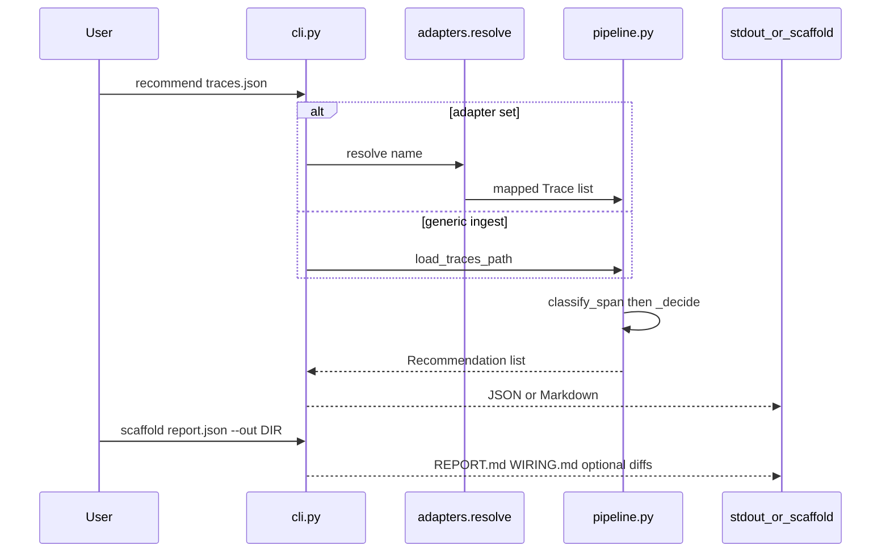
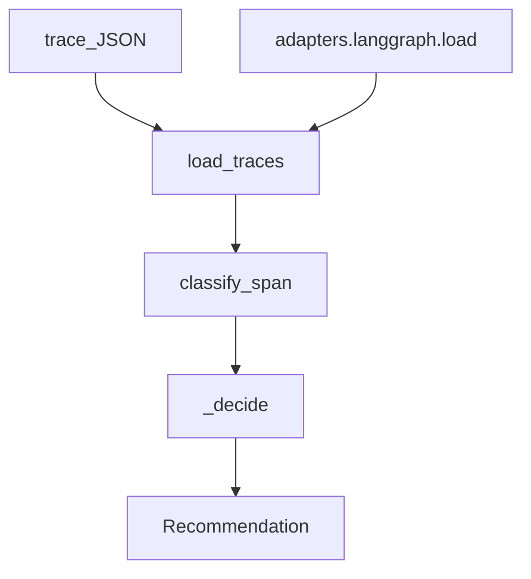

# Superdeterminism — extensive internals

Companion to the main [README](../README.md). How the repo runs, every first-party package, and why the important files exist. Do not invent paths.

## Table of contents

- [1. How this repository runs](#1-how-this-repository-runs)
- [2. Package map](#2-package-map)
- [3. Packages](#3-packages)
- [4. Configuration](#4-configuration)
- [5. Tests and CI](#5-tests-and-ci)
- [6. Ideas worth understanding](#6-ideas-worth-understanding)
- [7. Further reading](#7-further-reading)
- [8. Future advancements](#8-future-advancements)

## 1. How this repository runs

There is no HTTP server. A human or an agent runs a CLI against a JSON trace file. The process loads spans, buckets them by node, scores historical variance, and prints a report. Optional `--adapter langgraph` rewrites attributes first. Optional `scaffold` writes files under `--out` and never edits the user's graph.



Walkthrough:

1. `python -m superdeterminism` loads [`src/superdeterminism/__main__.py`](../src/superdeterminism/__main__.py), which calls `cli.main`.
2. `recommend` parses OTLP (`resourceSpans`) or `{ "traces": [ { "spans": [...] } ] }` in [`pipeline.load_traces`](../src/superdeterminism/pipeline.py).
3. Each span becomes `(node_id, node_kind, det.class)` via `classify_span`.
4. `_decide` emits `FlipToDet`, `FlipToNondet`, `STRENGTHEN_SDB`, or `ABSTAIN`. Default `n_min` is 30.
5. Exit `0` even when every row is ABSTAIN. Exit `2` on bad input, unknown adapter, or missing extra.

## 2. Package map

| Package | Path | Role | Entry |
|---------|------|------|-------|
| `superdeterminism` | `src/superdeterminism/` | Agnostic advisor core + LangGraph adapter | `python -m superdeterminism` / `recommend_traces` |
| tests | `tests/` | pytest for ingest, decide rules, adapter, import hygiene | `python -m pytest -q` |
| docs | `docs/` | Research contract, ADRs, this file | [docs/README.md](README.md) |
| scripts | `scripts/` | Vendor helpers from cursor-config-coding | PowerShell one-shots |
| `.cursor/` | `.cursor/` | Vendored rules/skills (copy, not symlink) | pin in [`.cursor/VENDOR.md`](../.cursor/VENDOR.md) |

`.cursor/` is a vendor tree. Do not file-list it here. Pin: [`.cursor/VENDOR.md`](../.cursor/VENDOR.md).

## 3. Packages

### 3.1 `superdeterminism` (`src/superdeterminism`)

**What it is for.** Map traces to an architecture graph and recommend determinism-class flips without importing LangChain in the core.

**How it is used.** `pip install -e .` then `python -m superdeterminism recommend …`. Library callers import `recommend_traces`, `Trace`, and `Span` from [`src/superdeterminism/__init__.py`](../src/superdeterminism/__init__.py). Console script `superdeterminism` is wired in [`pyproject.toml`](../pyproject.toml).

**How it works.** `cli.py` is a thin argparse shell. Ingest and L0 live in `pipeline.py`. Types live in `models.py`. `adapters/__init__.py` maps adapter names to modules and only imports `langgraph.py` inside `resolve()`. `scaffold.py` writes illustrative files from a report dict.



#### File map

| File | Why it is here | What it does |
|------|----------------|--------------|
| [`src/superdeterminism/__init__.py`](../src/superdeterminism/__init__.py) | Public surface without pulling CLI or adapters | Re-exports types + `recommend_traces`; `__version__ = "0.1.0"` |
| [`src/superdeterminism/__main__.py`](../src/superdeterminism/__main__.py) | `python -m` entry | Calls `cli.main` and exits |
| [`src/superdeterminism/cli.py`](../src/superdeterminism/cli.py) | Non-interactive agent/human interface | `recommend` and `scaffold` subcommands; JSON/MD stdout |
| [`src/superdeterminism/models.py`](../src/superdeterminism/models.py) | One source of truth for domain enums | `NodeKind`, `DetClass`, `Action`, `Span`, `Trace`, `Recommendation` |
| [`src/superdeterminism/pipeline.py`](../src/superdeterminism/pipeline.py) | All L0 policy in one module | OTLP/flat ingest, classify, Wilson `p_mode`, `_decide` |
| [`src/superdeterminism/scaffold.py`](../src/superdeterminism/scaffold.py) | Write-only refactor assist ([ADR 0003](decisions/0003-no-auto-apply.md)) | `REPORT.md`, `WIRING.md`, `patches/*.diff`; skips ABSTAIN |
| [`src/superdeterminism/adapters/__init__.py`](../src/superdeterminism/adapters/__init__.py) | Keep framework extras off the core import path | Lazy `resolve(name)`; `find_spec` for extras |
| [`src/superdeterminism/adapters/langgraph.py`](../src/superdeterminism/adapters/langgraph.py) | P1 mapper; only file allowed to *mention* LangGraph shapes in code | Attribute rewrite: drop `__start__`/`__end__`, remap `model`, retriever quirk. **No LangChain import.** |

Cross-package edges: tests import the package; docs describe the same types; adapters call `pipeline.load_traces` and return `Trace` objects the recommender already understands.

### 3.2 tests (`tests`)

**What it is for.** Lock ingest, decide rules, CLI exit codes, adapter mapping, and the “no LangChain in core” invariant.

**How it is used.** `python -m pytest -q` from the repo root (`[tool.pytest.ini_options]` in [`pyproject.toml`](../pyproject.toml)). Adapter tests that need extras skip or assert exit 2 when LangGraph is missing.

**How it works.** Core tests live at `tests/test_*.py`. P1 tests live under `tests/adapters/`. Fixtures are JSON traces, not a live LLM.

#### File map

| File | Why it is here | What it does |
|------|----------------|--------------|
| [`tests/test_pipeline.py`](../tests/test_pipeline.py) | Decision rules are the product | Flip / ABSTAIN / hard-override cases |
| [`tests/test_cli.py`](../tests/test_cli.py) | Agents depend on exit codes and JSON | `recommend` / `scaffold` CLI |
| [`tests/test_import_hygiene.py`](../tests/test_import_hygiene.py) | Enforce ADR 0004 in CI-less clones | No `langchain`/`langgraph` import outside `adapters/langgraph.py`; no `create_react_agent` token in `src/` |
| [`tests/fixtures/advisor_stable_llm.json`](../tests/fixtures/advisor_stable_llm.json) | Tiny demo + ABSTAIN fixture | One `classify` chat span |
| [`tests/adapters/test_registry.py`](../tests/adapters/test_registry.py) | Lazy registry contract | Unknown adapter / missing extra |
| [`tests/adapters/test_adapter_cli.py`](../tests/adapters/test_adapter_cli.py) | `--adapter` without extra must exit 2 | CLI wiring |
| [`tests/adapters/test_langgraph.py`](../tests/adapters/test_langgraph.py) | Mapper, not recommender | `create_agent` + StateGraph + retriever quirk |
| [`tests/adapters/test_scaffold.py`](../tests/adapters/test_scaffold.py) | No auto-apply | ABSTAIN has no patch; write-only dir |
| [`tests/adapters/fixtures/create_agent_otlp.json`](../tests/adapters/fixtures/create_agent_otlp.json) | P1 graph shape | `create_agent` / `model` / tools |
| [`tests/adapters/fixtures/stategraph_otlp.json`](../tests/adapters/fixtures/stategraph_otlp.json) | Custom graph shape | `StateGraph` nodes |
| [`tests/adapters/fixtures/langsmith_retriever_quirk.json`](../tests/adapters/fixtures/langsmith_retriever_quirk.json) | LangSmith retriever→embeddings quirk | Attribute remap to `retrieval` |

### 3.3 docs (`docs`)

**What it is for.** The research contract: what we may claim, how ingest maps, how a flip is estimated. Cursor-config vendor guides live in `docs/cursor-config/` so they are not mistaken for product docs ([DECISIONS.md](../DECISIONS.md) D3).

**How it is used.** Humans and agents read [docs/README.md](README.md) first. Product README “Go deeper” points here.

**How it works.** One topic per file, kept short. ADRs in `docs/decisions/`. Bibliography dated in `references.md`.

#### File map

| File | Why it is here | What it does |
|------|----------------|--------------|
| [`docs/README.md`](README.md) | Doc map | Ordered reading list |
| [`docs/overview.md`](overview.md) | Product brief | Problem, loop, audience |
| [`docs/landscape.md`](landscape.md) | Claim hygiene | Safe vs unsafe whitespace claims |
| [`docs/ingestion.md`](ingestion.md) | OTel is interchange, not the domain model | Pin GenAI conventions commit |
| [`docs/architecture.md`](architecture.md) | Persist `node_kind` / `det.class` | Span → node mapping |
| [`docs/methodology.md`](methodology.md) | How a flip is estimated | L0/L1/L2; simulation ≠ production |
| [`docs/adapters.md`](adapters.md) | Adapter surface | LangGraph v0 notes |
| [`docs/refactor.md`](refactor.md) | Report + scaffold policy | No auto-apply |
| [`docs/usage.md`](usage.md) | CLI for agents and humans | Flags, sample I/O |
| [`docs/roadmap.md`](roadmap.md) | P0/P1/P2 index | What is built vs specified |
| [`docs/p1-langgraph.md`](p1-langgraph.md) | P1 spec (implemented) | Mapper + scaffold rules |
| [`docs/p2-ecosystem.md`](p2-ecosystem.md) | P2 spec (not built) | Lang sinks + other stacks |
| [`docs/references.md`](references.md) | Bibliography | Dated 2026-08-15 |
| [`docs/decisions/0001-otel-ingest.md`](decisions/0001-otel-ingest.md) | ADR | Advisor fields stay out of `gen_ai.*` |
| [`docs/decisions/0002-v0-offline-first.md`](decisions/0002-v0-offline-first.md) | ADR | L0 before live L2 |
| [`docs/decisions/0003-no-auto-apply.md`](decisions/0003-no-auto-apply.md) | ADR | Scaffold only |
| [`docs/decisions/0004-agnostic-core.md`](decisions/0004-agnostic-core.md) | ADR | Zero framework deps in core |
| `docs/cursor-config/` | Vendored coding-config guides | MCP, Spec Kit, learning — not product |

Root contract files (not a package, listed so the tree matches): [`AGENTS.md`](../AGENTS.md), [`PROJECT_OVERVIEW.md`](../PROJECT_OVERVIEW.md), [`IMPLEMENTATION_PLAN.md`](../IMPLEMENTATION_PLAN.md), [`PROGRESS.md`](../PROGRESS.md), [`DECISIONS.md`](../DECISIONS.md), [`LEARNING.md`](../LEARNING.md), [`CONTRIBUTING.md`](../CONTRIBUTING.md), [`LICENSE`](../LICENSE), [`assets/superdeterminism-logo.svg`](../assets/superdeterminism-logo.svg).

### 3.4 scripts (`scripts`)

**What it is for.** Copy/junction helpers from the coding-config vendor. Cloud Agents use committed `.cursor/` files, not these scripts, but the scripts remain for local Windows linking.

**How it is used.** PowerShell against a target repo. Superdeterminism itself does not run them in pytest.

#### File map

| File | Why it is here | What it does |
|------|----------------|--------------|
| [`scripts/link-to-project.ps1`](../scripts/link-to-project.ps1) | Junction a project `.cursor` to a config clone | `mklink /J` |
| [`scripts/install-spec-kit.ps1`](../scripts/install-spec-kit.ps1) | Scaffold `.specify/` in a target | Spec Kit install |
| [`scripts/install-catalog-skill.ps1`](../scripts/install-catalog-skill.ps1) | Optional stack skill | Catalog install |

## 4. Configuration

No `.env`. No runtime config service. Behavior is CLI flags + `pyproject.toml`.

| Setting | Where | Default |
|---------|-------|---------|
| Python | [`pyproject.toml`](../pyproject.toml) `requires-python` | `>=3.10` |
| Core deps | `dependencies` | empty (stdlib) |
| Dev extra | `[dev]` | `pytest>=8` |
| LangGraph extra | `[langgraph]` | `langchain`, `langgraph`, `langchain-core` (pinned ranges) |
| `n_min` | `--n-min` / `N_MIN_DEFAULT` in `pipeline.py` | `30` |
| `SCHEMA_OK_MIN` | `pipeline.py` | `0.80` |
| `P_MODE_MIN` | `pipeline.py` | `0.70` |
| Adapter | `--adapter` | omitted = generic ingest |

Hard override regex in `pipeline.py`: node ids matching refund/commit/payment/auth/PII/secret/spend/charge stay `STRENGTHEN_SDB` rather than a flip.

## 5. Tests and CI

Run:

```bash
pip install -e ".[dev]"
python -m pytest -q
```

With the LangGraph extra, adapter happy-path tests run; without it, `--adapter langgraph` must exit 2. Both modes are required ([LEARNING.md](../LEARNING.md) P1 notes).

There is no `.github/workflows` tree in this clone. Quality bar for a PR is still `python -m pytest -q` plus the import-hygiene tests.

## 6. Ideas worth understanding

**Determinism class.** A node is not just “a span.” It has `det.class` (function, LLM, seeded LLM, composite, …). The intervention is changing that class, not replaying the same policy. See [architecture.md](architecture.md).

**Wilson lower bound.** A point estimate of “always the same JSON” can be 1.00 with `n=1` and still be noise. The advisor uses a [Wilson score interval](https://en.wikipedia.org/wiki/Binomial_proportion_confidence_interval) on the mode share. If the lower bound is below `0.70`, it ABSTAINs. That is why the README demo abstains.

**L0 vs L2.** L0 splices recorded I/O (cheap, partial). L2 would swap the live policy and roll forward (confirmatory, expensive, off by default). [Methodology](methodology.md) maps these to Pearl’s ladder. Temperature 0 is not a seed ([Thinking Machines](https://thinkingmachines.ai/blog/defeating-nondeterminism-in-llm-inference/)).

**Agnostic core.** If the recommender imported LangGraph, CrewAI would be a lie. P1 is one file that rewrites attributes. P2 is when a second adapter justifies a `Protocol` ([p2-ecosystem.md](p2-ecosystem.md), [0004-agnostic-core.md](decisions/0004-agnostic-core.md)).

## 7. Further reading

| Idea | Link | What you will learn |
|------|------|---------------------|
| Determinism-class flip | [methodology.md](methodology.md) | Local source; no external paper yet |
| `do_policy` / point-of-commitment | [Causal Agent Replay](https://arxiv.org/abs/2606.08275) | Step intervention for *attribution*, not class re-typing |
| Residual LLM nondeterminism | [Defeating Nondeterminism in LLM Inference](https://thinkingmachines.ai/blog/defeating-nondeterminism-in-llm-inference/) | Why greedy hosted decoding is not a seed |
| Wilson score interval | [Wikipedia: binomial proportion CI](https://en.wikipedia.org/wiki/Binomial_proportion_confidence_interval) | Why `p_mode_lower` exists |
| OTel GenAI conventions | [semantic-conventions-genai](https://github.com/open-telemetry/semantic-conventions-genai) | Development-status interchange |
| P1 graph API | [LangChain `create_agent`](https://docs.langchain.com/oss/python/langchain/agents) | Shape the adapter maps |

## 8. Future advancements

### P2 adapter contract (Track B)

- **Why now.** Core is agnostic so a second stack can plug in without pretending to be LangGraph. Spec: [`docs/p2-ecosystem.md`](p2-ecosystem.md).
- **What would land.** Documented adapter `load()` contract, `[crewai]` or raw-custom extra, tests that the same `recommend_traces` runs.
- **Done when.** At least one non-Lang adapter plus a custom example, still zero framework imports in core.

### Lang ecosystem sinks (Track A)

- **Why now.** Teams already dump traces from LangSmith / Langfuse / MLflow; file JSON is the air-gap path.
- **What would land.** Native pull or quirk tables per sink, still offline-first ([0002-v0-offline-first.md](decisions/0002-v0-offline-first.md)).
- **Done when.** One extra ingest path beyond “hand us a JSON file,” without a live collector requirement.

### L1 hybrid fork on high-EV candidates

- **Why now.** L0 lies when the next call-site misses the cassette ([methodology.md](methodology.md)).
- **What would land.** Optional L1: replay prefix, live-execute the divergent tail, still no default production-LLM re-run.
- **Done when.** Gated behind a flag; L0 remains the default CLI path.

### Confirmatory canary language in the report

- **Why now.** Reports already say `simulation != production`; consumers still treat JSON as a ship decision.
- **What would land.** Explicit canary checklist in `scaffold` `REPORT.md` (`src/superdeterminism/scaffold.py`) when a flip is recommended.
- **Done when.** Flip reports name the outcome vector to match in a canary; ABSTAIN reports stay reasons-only.
